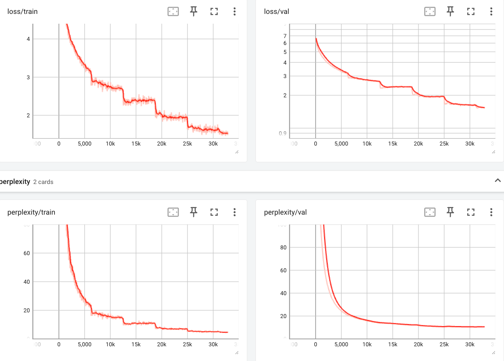

Bidirectional LSTM based seq2seq model with attention mechanism for language translation

* training: model trained w. cross validation for early stopping
  see below tensorboard plot for training session
* testing: BLEU of ~21.77 is achieved

